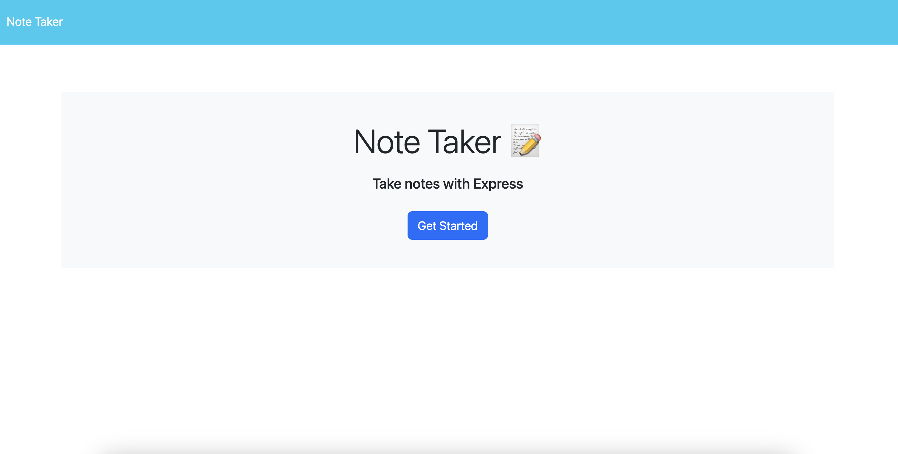

# Note Taker

Note Taker is a simple web application that allows users to create, view, and delete notes. This application is built using Node.js and Express, with a minimal front-end using HTML, CSS, and vanilla JavaScript.

# Screenshot Of Application

 

## Features

- **Create Notes**: Users can add new notes with a title and body.
- **View Notes**: All saved notes are displayed in a list and can be viewed by clicking on them.
- **Delete Notes**: Users can delete any note.

## Technologies

- Node.js
- Express
- HTML
- CSS
- JavaScript

### Prerequisites

What you need to install the software:

- Node.js
- NPM 

### Installing

 - npm install

## Usage

- To use the application, navigate to http://localhost:3001 on your browser:

- Click on "Get Started" to go to the notes page.
- Enter a title and text for a new note and click "Save" to store the note.
- Click on any note in the list to view its details.
- Click on the "Delete" icon next to a note to remove it.

## GITHUB LINK
- https://github.com/SpencerKlink/note-taker

## WEB LINK 
- https://safe-scrubland-76270-f24f37ab1a96.herokuapp.com